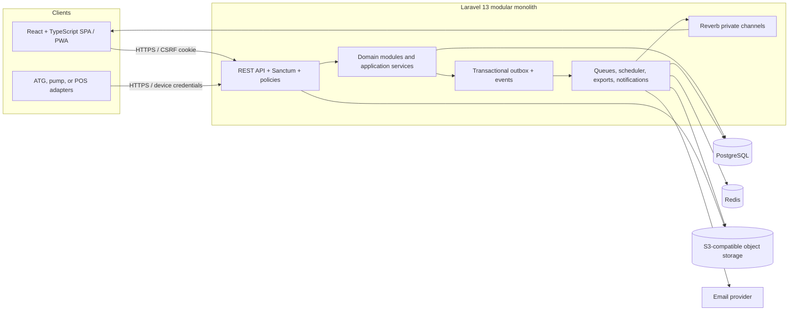
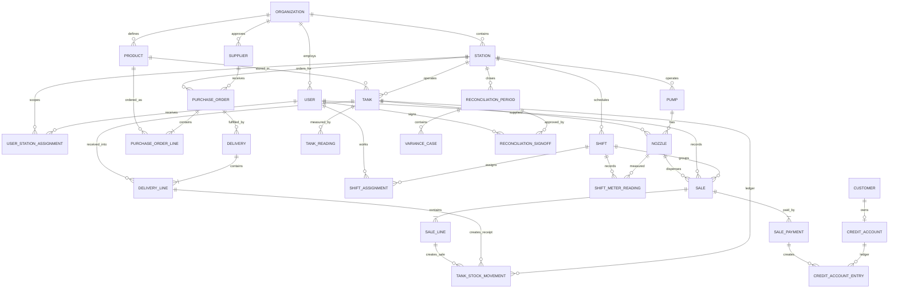

# FuelFlow FSMS implementation plan

Status: implementation-ready baseline with implementation decisions fixed in Section 3
Source requirements: Functional Requirements Document (FRD), version 1.0 Draft, 26 July 2026
Visual references only: Owner / Admin, Station Controller, and Shift Supervisor HTML dashboards
Prepared: 6 August 2026

## 1. Executive decision

Build FuelFlow as a modular monolith with a Laravel 13 JSON API and a React 19.2 single-page application written in TypeScript 6.0. Keep backend and frontend in one repository, but enforce module boundaries so high-volume or integration-heavy areas can be extracted later without rewriting the domain.

The recommended production baseline is:

| Layer | Choice | Reason |
|---|---|---|
| Backend | Laravel 13 on PHP 8.4 or 8.5 | Current supported Laravel generation, strong authorization, queues, scheduling, broadcasting, validation, and testing |
| Frontend | React 19.2 with TypeScript 6.0 and Vite | Type-safe role-specific SPA, reusable dashboard components, and PWA/offline support |
| API | Versioned REST/JSON under `/api/v1` with an OpenAPI contract | Stable web, mobile, device, and integration boundary |
| Authentication | Laravel Sanctum cookie-based SPA sessions | CSRF-protected first-party authentication without exposing browser tokens |
| Authorization | Laravel policies plus database-backed roles, permissions, and station scope | Every action is checked at both route/policy and query scope |
| Primary database | PostgreSQL | Transactions, constraints, indexing, reporting, JSON metadata, and strong concurrency behavior |
| Cache/queues | Redis plus Laravel Horizon | Background exports, scheduled reports, notifications, and operational queue visibility |
| Real time | Laravel Reverb, Echo, and private channels | Live sales, stock, shift, variance, and dashboard updates |
| Files | S3-compatible object storage with signed access | Supplier, delivery, receipt, and report documents |
| Search/report read models | PostgreSQL views/materialized summaries initially | Avoid premature search or analytics infrastructure |
| Deployment | Containerized web, worker, scheduler, and Reverb processes | Reproducible environments and independent scaling |

Laravel 13 requires PHP 8.3 or later and receives security fixes through March 2028. The official React documentation lists 19.2 as the latest major/minor line, and TypeScript 6.0 is the current transition release. Pin exact patch versions in lockfiles and update them through tested dependency pull requests.

This plan treats "no bugs" as a quality objective, not a claim that software can be mathematically guaranteed defect-free. Release is blocked by any known Severity 1 or Severity 2 defect, an unmet requirement, a failed invariant, a failed security gate, or incomplete UAT evidence.

## 2. Scope baseline

### 2.1 In scope

All eleven FRD modules are in scope:

1. User Management
2. Supplier Management
3. Procurement
4. Fuel Receiving
5. Fuel Product Management
6. Tank Management
7. Pump Management
8. Sale Management
9. Daily Reconciliation
10. Reporting
11. Dashboard

The following cross-cutting scope is also mandatory because it appears in the FRD flows, module links, dashboard requirements, or non-functional notes:

- Organization and multi-station hierarchy.
- Role and station-scoped access.
- Immutable audit history for financial and stock-affecting operations.
- Product, price, money, and volume history.
- Customer credit/fleet accounts and outstanding balances.
- Shift assignments, POS/till counts, incidents, and variance cases.
- Offline sale capture for short network outages.
- Real-time dashboard refresh and drill-down.
- Scheduled email reports.
- Document upload and secure retrieval.
- Automatic tank gauge and pump/device integration interfaces.
- Reconciliation locking and controlled administrative reopening.

### 2.2 Explicitly not assumed

The following items are outside this implementation baseline:

- General ledger, accounts payable, payroll, or tax filing.
- Card acquiring, mobile-money settlement, or banking integrations. The base scope records and reconciles payment methods; live payment processing requires provider contracts.
- Fuel price optimization or AI forecasting.
- Convenience-store inventory beyond the FRD's optional mention of non-fuel sales.
- Native iOS or Android applications.
- Hardware procurement, installation, or calibration.
- Country-specific fiscal devices, e-invoicing, environmental reports, or statutory retention rules.

The architecture leaves extension points for these items without placing them on the critical path.

## 3. Fixed implementation decisions

The FRD prints 77 requirement identifiers. Seventy-six contain requirement text. One identifier is blank, and one expected identifier is absent.

All gaps and ambiguities use the following implementation rules. They are part of scope and may be coded without a further requirements decision.

| ID | Implementation rule |
|---|---|
| IMP-001 | Add `FR-DR-04`: calculate pump/nozzle variance between meter-derived volume and recorded sale volume per shift and business day. |
| IMP-002 | Define the blank `FR-DR-08`: every out-of-tolerance tank, pump, delivery, or cash variance requires a reason, comment, assigned resolver, and resolution status before reconciliation sign-off. |
| IMP-003 | Use PO states `Draft -> Pending Approval -> Approved -> Sent -> Partially Received -> Received -> Closed`, with terminal states `Rejected` and `Cancelled`. |
| IMP-004 | A PO becomes immutable when sent. Later commercial change uses a numbered amendment that repeats approval. Receipt updates only delivered/remaining quantities and status. |
| IMP-005 | Never hard-delete a user referenced by authentication, audit, shift, financial, stock, or other business data. Deactivate and soft-delete the profile. Hard deletion is allowed only before the account has any activity. |
| IMP-006 | Inactivity timeout is configurable with an FRD-aligned default of 24 hours. POS sessions also end when the assigned shift closes. Password/role/bank/reconciliation-reopen actions require re-authentication when the last authentication is older than 30 minutes. |
| IMP-007 | FRD Sale Management flow steps are binding derived requirements: payment method, credit-limit check, receipt, tank decrement, shift total, reconciliation handoff, correction, and offline sync. |
| IMP-008 | Implement Customer and Credit Account inside Sale Management. Aging buckets are Current, 1-30, 31-60, 61-90, and Over 90 days. Credit limit, balance, available credit, status, and immutable entries are required. |
| IMP-009 | Currency is fixed to Ghanaian cedi (`GHS`) for this deployment. Money totals use `numeric(18,2)`, unit prices use `numeric(18,4)`, litres use `numeric(18,3)`, and multiplication rounds half-up to two decimal places. API amounts are decimal strings with `currency: "GHS"`. |
| IMP-010 | Selling prices are treated as final tax-inclusive pump prices. The baseline does not calculate separate taxes or statutory levies. Receipts show GHS totals and configured station tax/registration identifiers without deriving tax amounts. |
| IMP-011 | Cash, card, mobile money, credit account, and fleet account are recording/reconciliation methods. Card and mobile-money records require an external reference when available; this baseline does not authorize or settle payments with a provider. |
| IMP-012 | A pre-dispense check warns when a sale would make book stock negative. Because physically dispensed fuel must never disappear from records, the sale is accepted with a mandatory critical variance case and Station Manager review. Credit-limit failure remains blocking unless an Administrator records an override reason. |
| IMP-013 | Default variance tolerances are: delivery 0.50% of waybill quantity, tank 0.50% of book stock, pump 0.50% of meter-derived volume, and cash GHS 0.00. Administrator may configure stricter station/product values; the effective tolerance is snapshotted on the transaction/reconciliation. |
| IMP-014 | Shifts may span midnight. The shift belongs to the station-local business date on which it opened; all sales and readings assigned to that shift use that business date. It must close before that business date can be reconciled. |
| IMP-015 | Quantities are observed litres with no temperature correction. ATG-supplied standardized volume may be retained as a separate reading but never silently replaces observed/book litres. |
| IMP-016 | Every PO requires one approval by an Administrator or Owner-capability user who is not the PO creator. The approver may reject with a required reason. There are no amount thresholds in the baseline. |
| IMP-017 | One delivery record fulfills one PO at one station, with one or more delivery lines. Split deliveries are represented by several delivery records; partial receipt status tracks the remaining PO quantity. |
| IMP-018 | A business receipt contains organization/station, configured registration identifier, unique receipt number, station-local date/time, attendant, shift, pump/nozzle, product, litres, GHS unit price, GHS total, payment method/reference, transaction status, and original/reprint marker. Reprints are allowed and audited. |
| IMP-019 | Scheduled reports may be sent only to recipients created and verified by an Administrator. Exports up to 10 MB are attached; larger exports use a signed link that expires after 72 hours. Every attempt and outcome is audited. |
| IMP-020 | Retain users, audit, sales, stock, procurement, receiving, reconciliation, reports, and financial attachments for seven years. Retain raw ATG/device payloads for two years. Legal hold prevents expiry. |
| IMP-021 | Support the latest two stable versions of Chrome and Edge on desktop/POS, a minimum 1280x720 POS viewport, 1024 px tablet workflows, and 1440 px desktop dashboards. Responsive views remain usable down to 768 px; phone sale entry is not a baseline target. |
| IMP-022 | Service recovery targets are RPO <= 15 minutes and RTO <= 4 hours. Quarterly restoration tests are mandatory. |
| IMP-023 | Built-in device integration supports authenticated REST/JSON push, MQTT JSON ingestion, and controlled CSV import through a mapping profile. Include a simulator and quarantine invalid/stale readings. Vendor-specific physical certification is deployment configuration, not a requirements decision. |
| IMP-024 | Supplier score uses the latest 20 completed deliveries or trailing 12 months, whichever contains more data: 50% on-time delivery, 30% quantity accuracy, and 20% quality pass rate. Preserve each component so the score is explainable. |
| IMP-025 | All stations use an IANA time zone. If no station value is loaded during migration, default to `Africa/Accra`; persist UTC instants plus station-local business date. |
| IMP-026 | Offline sale entry is limited to four hours from the last successful synchronization and GHS 10,000 per transaction. Only cash sales may be entered offline. Other payment methods require connectivity. |
| IMP-027 | A meter normally requires closing reading >= opening reading. A configured mechanical meter maximum enables one rollover calculation; more than one rollover in a shift is rejected for Station Manager investigation. |
| IMP-028 | Accountant edit rights are limited to saved report views, report schedules/recipients within authorized stations, and comments on an unlocked reconciliation. Accountant cannot change source transactions, approve POs, sign off/reopen reconciliation, manage access, or change prices/assets. |

## 4. Product and UX blueprint

### 4.1 Role-source rule

The HTML samples define appearance only: colors, typography, spacing, cards, charts, tables, badges, sidebar treatment, and visual density. Their titles and labels such as "Station Controller", "Shift Supervisor", "Group Director", and personal names do not create roles, permissions, workflows, or requirements.

User roles and capabilities come only from the FRD:

| FRD role/capability profile | FRD-defined responsibility |
|---|---|
| Administrator | Full system access and configuration rights. Creates/manages users, resets access, assigns stations/roles, and may perform controlled administrative reopening/overrides with audit. |
| Owner | Explicitly referenced by the FRD dashboard and PO approval flows. Sees all authorized stations and may approve/reject POs. No additional HR or corporate capability is inferred from the sample. |
| Station Manager | Manages procurement, receiving, tanks, pumps, staff scheduling, and reconciliation for the assigned station. Performs required receiving variance and reconciliation sign-offs. |
| Cashier / Pump Attendant | Records sales at the assigned pump, starts/ends assigned shifts, records required meter readings, selects payment method, issues receipts, and submits counted cash/payment slips. |
| Accountant | Views reconciliation, reporting, and financial data, with limited edit rights restricted to report schedules and non-locked reconciliation comments assigned by policy. |
| Auditor | Read-only access to all authorized modules and audit evidence. Cannot create, edit, approve, sign off, reopen, reverse, or delete. |

There is no separate Shift Supervisor or Station Controller role. Screens visually inspired by those samples are presented to the appropriate FRD role: Station Manager for station/shift oversight and Cashier/Pump Attendant for assigned shift actions.

### 4.2 Visual direction extracted from the supplied samples

Preserve the samples' visual language:

- Fixed 260 px desktop sidebar with role-specific navigation.
- White cards on a light neutral background, one-pixel borders, restrained shadow, and compact data density.
- Blue primary action and chart color; green, amber, red, and slate statuses.
- Large KPI numerals with smaller uppercase labels and contextual deltas.
- Dashboard structure of KPI row, primary chart, stock/exception panel, data table, and operational cards.
- Compact chips for reconciliation, stock, delivery, transaction, and variance status.
- Direct drill-down from KPI, alert, table row, and exception card.

Convert the prototype styles into shared design tokens rather than copying each HTML file:

- `color.brand`, `color.surface`, `color.canvas`, `color.border`, `color.text`, and semantic status tokens.
- Type scale, spacing scale, radius, elevation, focus ring, chart palette, table density, and motion duration.
- Shared `AppShell`, `Sidebar`, `PageHeader`, `KpiCard`, `StatusBadge`, `DataTable`, `FilterBar`, `ChartCard`, `EmptyState`, `ErrorState`, `OfflineBanner`, `ConfirmDialog`, and `AuditDrawer`.

### 4.3 Role experiences

| Persona | Landing view | Primary tasks |
|---|---|---|
| Administrator | Administration Dashboard | Users, roles, stations, configuration, exception overrides, audit, and every module |
| Owner | Portfolio Dashboard | All authorized stations, portfolio KPIs, PO approvals, exceptions, reports, and drill-down |
| Station Manager | Station Dashboard | Procurement, receiving, tanks, pumps, staff scheduling, sales oversight, reconciliation, reports |
| Cashier / Pump Attendant | Assigned Shift / Sale Terminal | Open assigned shift, record readings and sales/payment, issue receipt, count cash, close assigned shift |
| Accountant | Reconciliation and Reporting | Review reconciliation/financial data, reports, exports, and report schedules within limited edit permission |
| Auditor | Read-only Dashboard / Audit | Search actions, inspect source records and changes, and export permitted evidence without mutation rights |

### 4.4 Information architecture

Administrator navigation:

- Dashboard
- User Management
- Supplier Management
- Procurement
- Fuel Receiving
- Fuel Product Management
- Tank Management
- Pump Management
- Sale Management
- Daily Reconciliation
- Reporting
- System Configuration
- Audit Logs

Station Manager navigation:

- Dashboard
- Sale Management
- Pump Management
- Tank Management
- Fuel Products and Prices
- Fuel Receiving
- Procurement
- Suppliers
- Daily Reconciliation
- Reporting
- Users and Shifts

Owner navigation:

- Portfolio Dashboard
- Station Performance
- PO Approvals
- Reporting
- Exceptions
- Audit

Cashier / Pump Attendant navigation:

- Assigned Shift
- Sale Entry
- Meter Readings
- Receipts
- Cash Count / Shift Close

Accountant navigation:

- Dashboard
- Daily Reconciliation
- Reporting
- Report Schedules

Auditor navigation:

- Read-only Dashboard
- Read-only Modules
- Audit Report

### 4.5 Required UX states

Every screen and reusable component must have designed and tested states for:

- Loading/skeleton.
- Empty but valid.
- Permission denied.
- Validation failure.
- Server/network error with retry.
- Offline, queued locally, syncing, sync conflict, and synced.
- Stale live data with "last updated" time.
- Archived/deactivated records.
- Locked reconciliation period.
- Concurrent update conflict.
- Long-running export queued, running, ready, failed, and expired.
- Desktop, tablet, and minimum supported POS viewport.

Status may never rely on color alone. All interactive controls need keyboard operation, visible focus, programmatic labels, appropriate table semantics, and WCAG 2.2 AA contrast.

## 5. System architecture



### 5.1 Modular boundaries

Use `app/Domain/<Module>` and `app/Application/<Module>` boundaries:

- IdentityAndAccess
- OrganizationAndStation
- Supplier
- ProductAndPricing
- Procurement
- Receiving
- InventoryTank
- PumpAndShift
- SalesAndCredit
- Reconciliation
- Reporting
- Dashboard
- Integration
- Audit

Controllers remain thin. They validate transport input, call an application command/query, and return API resources. Domain services own invariants. Eloquent models do not contain cross-module workflows.

Cross-module changes run through explicit application services inside one database transaction. An outbox row is written in that same transaction, then a queue worker publishes notifications, broadcasts, and integration work. Do not place business-critical stock updates only in an eventually consistent listener.

### 5.2 Repository layout

```text
/
  apps/
    api/                         Laravel 13 application
    web/                         React + TypeScript + Vite application
  packages/
    api-client/                  Generated TypeScript client and schemas
    ui/                          Shared design system
    eslint-config/
    tsconfig/
  contracts/
    openapi.yaml
    events/
  infrastructure/
    docker/
    deployment/
    observability/
  docs/
    adr/
    runbooks/
    test-evidence/
```

If the team is small, `packages/*` may live under `apps/web/src`; the API contract must still remain independent and versioned.

### 5.3 Frontend implementation standards

- React Router for route composition, permission-aware navigation, and typed filter/search parameters.
- TanStack Query for server state, caching, invalidation, retries, and optimistic UI only where the domain permits it.
- React Hook Form plus Zod schemas generated or aligned with the OpenAPI contract.
- Tailwind CSS compiled from the shared design tokens used by the reference dashboards.
- ApexCharts through a React wrapper to preserve the prototype chart direction; every chart also exposes an accessible table/summary.
- Dexie/IndexedDB plus a service worker for the constrained offline sale queue.
- No general-purpose global state store initially. Use route state, query cache, form state, and narrow React context; add one only when a demonstrated cross-cutting client-state need exists.
- Vitest, React Testing Library, Mock Service Worker, axe, and Playwright for frontend verification.
- Lazy-load role/module routes, but prefetch the currently selected station dashboard and assigned shift data.
- Error boundaries at application, route, and high-risk widget levels.

The browser never owns a business invariant. It can pre-validate for speed, but Laravel repeats authorization, validation, price resolution, state transition, capacity, credit, and lock checks.

### 5.4 API conventions

- Base path: `/api/v1`.
- JSON field names: `snake_case` at the API boundary to match Laravel; generated client maps them without hand-written duplication.
- IDs: UUIDv7 or ULID, generated server-side. Human references such as PO and receipt numbers are separate.
- Pagination: cursor pagination for transactions/audit; page pagination where stable totals matter.
- Filtering: explicit allowlisted query parameters.
- Errors: one documented envelope with machine code, message, field errors, correlation ID, and optional conflict metadata.
- Dates: ISO 8601 with offset; persist instants in UTC and store the owning station time zone/business date.
- Money: decimal strings with `currency: "GHS"`; never JSON floating point.
- Volume: decimal strings plus unit.
- Idempotency: `Idempotency-Key` required on sale, receiving confirmation, transfer, shift close, reconciliation sign-off, and device ingestion.
- Concurrency: `version`/ETag required for mutable aggregates; stale writes return HTTP 409 with current version.
- Deletes: soft delete or deactivate for referenced master data.
- Documentation: OpenAPI is generated/validated in CI, and the TypeScript client is generated from it.

### 5.5 Multi-station isolation

Every station-owned row includes both `organization_id` and `station_id`, with foreign keys proving that the station belongs to the organization. Organization-wide master data explicitly uses a nullable station only where inheritance is intended.

Isolation is enforced in four places:

1. Authentication resolves organization and active station assignments.
2. Policies authorize action and station.
3. Query objects always apply the user's allowed station set.
4. Integration tests attempt cross-organization and cross-station access for every resource class.

The UI station selector changes query context; it never grants access.

## 6. Data architecture

### 6.1 Core rules

- Use `numeric(18,3)` for litres, `numeric(18,4)` for GHS per-litre prices, and `numeric(18,2)` for GHS totals. Round sale totals half-up to two decimal places.
- Every money-bearing row stores `currency = 'GHS'` with a database check constraint.
- Store a price snapshot on every PO line, delivery line, and sale line.
- Store both UTC timestamps and a derived station `business_date`.
- Do not update a tank's history in place. Record immutable stock movements and maintain a transactionally updated current balance.
- Do not update a financial sale after confirmation. Reverse and replace through linked correction records.
- Use database check constraints for non-negative capacity, valid reading order, amount calculations within rounding tolerance, and state-dependent required fields.
- Use partial unique indexes for active codes/numbers and idempotency keys.
- Use row-level locks when confirming deliveries, sales, transfers, shift closure, and reconciliation.
- Use append-only audit and outbox tables protected from application update/delete paths.

### 6.2 Entity groups

Identity and organization:

- `organizations`
- `stations`
- `station_settings`
- `users`
- `user_station_assignments`
- `roles`
- `permissions`
- `role_permissions`
- `user_role_assignments`
- `authentication_events`
- `audit_events`

Supplier and product:

- `suppliers`
- `supplier_contacts`
- `supplier_products`
- `supplier_price_terms`
- `supplier_documents`
- `supplier_performance_events`
- `products`
- `product_tank_compatibilities`
- `station_product_prices`
- `price_change_events`

Procurement and receiving:

- `purchase_orders`
- `purchase_order_lines`
- `purchase_order_approvals`
- `purchase_order_revisions`
- `deliveries`
- `delivery_lines`
- `delivery_dip_readings`
- `delivery_variances`
- `delivery_documents`

Tank inventory:

- `tanks`
- `tank_readings`
- `tank_stock_movements`
- `tank_transfers`
- `tank_alerts`
- `gauge_devices`
- `gauge_readings`

Pumps and shifts:

- `pumps`
- `nozzles`
- `pump_maintenance_events`
- `shifts`
- `shift_assignments`
- `shift_meter_readings`
- `pos_terminals`
- `till_counts`
- `incidents`

Sales and credit:

- `customers`
- `credit_accounts`
- `credit_account_entries`
- `sales`
- `sale_lines`
- `sale_payments`
- `receipts`
- `offline_devices`
- `offline_sync_batches`
- `offline_sync_items`

Reconciliation, reporting, and operations:

- `reconciliation_periods`
- `tank_reconciliations`
- `pump_reconciliations`
- `cash_reconciliations`
- `variance_cases`
- `reconciliation_signoffs`
- `reconciliation_reopenings`
- `report_schedules`
- `report_runs`
- `notification_deliveries`
- `attachments`
- `outbox_messages`
- `inbox_messages`

### 6.3 Core relationship map



### 6.4 Stock ledger

`tank_stock_movements` is the stock source of truth. Every row has:

- Tank, product, station, business date, occurred time.
- Type: opening, receipt, sale, adjustment, transfer-in, transfer-out, reconciliation-correction, or reversal.
- Exact quantity with a signed direction.
- Source aggregate type and ID.
- Idempotency key.
- Actor or device.
- Balance after the movement.
- Correlation ID and audit metadata.

The `tanks.current_book_stock` field is a cached balance updated in the same transaction. A scheduled integrity job recomputes ledger totals and alerts on any mismatch. Confirmed business transactions are never "fixed" by editing movement quantities; they are reversed and replaced.

### 6.5 Reconciliation lock model

A reconciliation owns a station, business date, optional shift, status, source cutoff, source version hash, tolerance snapshot, and sign-off data.

When signed off:

- Source row IDs and versions are snapshotted.
- The period becomes `Reconciled` and `locked_at` is set.
- Policy and database triggers reject changes whose `business_date` overlaps the lock.
- An administrator may reopen only with a reason and step-up authentication.
- Reopening creates an append-only event, changes the period to `Reopened`, and notifies the station manager/accountant/auditor.
- Re-sign-off creates a new version while retaining the original evidence.

## 7. Module implementation

### 7.1 User Management

Backend:

- User CRUD with active, inactive, locked, and pending-first-login states.
- Database-backed roles and granular permissions, optionally scoped to a station.
- Policies on every resource and workflow action.
- One-time credential delivery, first-login password change, and a separately hashed terminal PIN for Cashier/Pump Attendant POS use.
- Admin reset, compromise-driven password reset, rate limiting, and session revocation.
- Configurable inactivity handling and device-bound shift sessions.
- Login/logout/failure and significant-action audit events.
- User deactivation rather than destructive deletion once referenced.

Frontend:

- Users table with station, role, state, last login, and filters.
- User wizard: profile, station assignment, role, fine-grained overrides, credential delivery.
- Role/permission matrix with inherited versus explicit permissions.
- Session/device list and revoke action.
- Audit tab showing actor, time, action, target, before/after, and correlation ID.

Acceptance emphasis:

- A cashier cannot open or close another attendant's shift.
- An owner can view all assigned stations; a station manager cannot query another station.
- An auditor receives 403 for every mutation, including crafted API requests.
- Deactivated accounts lose sessions immediately and remain attributable in history.

### 7.2 Supplier Management

Backend:

- Supplier profile, contacts, address, tax/registration, protected bank details, status, and station/organization scope.
- Product-specific supplier price and payment terms with effective dates.
- Secure document metadata and signed downloads.
- Delivery/order history calculated from procurement/receiving.
- Performance events for timeliness, quality, and quantity accuracy using the fixed explainable formula in IMP-024.
- Selection query excludes inactive suppliers.

Frontend:

- Supplier list, profile summary, products/prices, terms, documents, performance, and history tabs.
- Rating badges and exception flags with explanation, not only a numeric score.
- Price and contract history.

Acceptance emphasis:

- Deactivating a supplier preserves historical POs and prevents new selection.
- A receiving confirmation updates delivery history and performance exactly once.
- Bank fields and documents are permission-protected and never appear in logs.

### 7.3 Procurement

Backend:

- PO header and multiple lines with supplier, product, quantity, quoted price, destination tank/station, expected date, terms, notes, and attachments.
- Price is suggested from supplier terms but captured as an immutable PO-line snapshot.
- Capacity forecast considers current stock, already scheduled inbound fuel, and tank safe maximum. It does not assume future consumption.
- One approval by an Administrator or Owner-capability user who is not the PO creator.
- Explicit PO state machine and transition authorization.
- Unique human-readable PO number generated transactionally.
- Due/overdue notifications and dashboard queries.
- Amendment/version history after sending; no silent edits.

Frontend:

- Guided PO creation with supplier/product price source, tank capacity meter, warnings, and approval summary.
- Approval inbox for Administrator and Owner-capability users with diff and comments.
- PO timeline with status, approvals, revisions, deliveries, and remaining quantity.

Acceptance emphasis:

- Invalid transitions and unauthorized approvals fail server-side.
- Concurrent approvals or number generation cannot duplicate action.
- A planned overfill blocks submission. The order quantity or destination tank must be changed before submission.
- Partial receipts update remaining quantities without marking the PO fully received.

### 7.4 Fuel Receiving

Backend:

- Select only open, sent, or partially received POs for the same station.
- Capture truck, driver, waybill/invoice, arrival/departure, delivery lines, target tanks, and documents.
- Require pre- and post-delivery dip readings.
- Calculate ordered-versus-waybill, waybill-versus-dip, and ordered-versus-dip variances.
- Validate product/tank compatibility and PO product.
- Out-of-tolerance variance case and Station Manager sign-off/comment.
- Confirm receipt, add stock ledger movements, update PO quantities/status, and update supplier performance in one database transaction.
- Idempotent confirmation and reversal workflow.

Frontend:

- Mobile/tablet-friendly receiving wizard with explicit stages: identify, pre-dip, offload, post-dip, compare, sign off, confirm.
- Variance table with absolute quantity and percentage.
- Camera/file document capture where device policies allow it.

Acceptance emphasis:

- A failed transaction changes no stock, PO quantity, or supplier performance.
- Duplicate confirmation returns the original result and does not add stock twice.
- Product mismatch or incompatible tank cannot be bypassed.

### 7.5 Fuel Product and Pricing

Backend:

- Unique product code, name, unit, grade/type, active state, and tank compatibility.
- Organization default and optional station-specific price schedules.
- Effective-dated prices with non-overlapping intervals.
- Full append-only price change history including reason and actor.
- Transaction-time price resolver.
- Deactivation, never deletion, when history exists.

Frontend:

- Product catalog and compatibility display.
- Price timeline and scheduled change form.
- Impact preview listing affected stations.

Acceptance emphasis:

- A sale uses the price effective at its occurred time and stores the price snapshot.
- Retroactive changes require exceptional permission and never rewrite existing sales.
- Products with history cannot be hard-deleted.

### 7.6 Tank Management

Backend:

- Tank setup with physical capacity, safe minimum/maximum, product, calibration metadata, and active state.
- Immutable stock movements and running book balance.
- Manual dip readings with source and measurement metadata. Observed litres remain authoritative; no temperature correction is applied.
- Low-stock and overfill alerts with deduplication and acknowledgement.
- Tank-to-tank transfer with compatible products and balanced transfer-out/transfer-in entries in one transaction.
- ATG adapter interface, device registry, signed ingestion, REST/JSON, MQTT JSON and CSV mapping profiles, raw reading retention, validation, quarantine, and simulator.

Frontend:

- Tank overview with litres, capacity percentage, days-of-stock estimate where sufficient data exists, and last reading time.
- Stock movement ledger, dip timeline, variance trend, alert history, and transfer wizard.
- Manual versus automatic reading source label.

Acceptance emphasis:

- Book stock always equals the signed ledger sum.
- Transfer sides cannot be partially committed.
- Inbound delivery plus booked inbound cannot exceed safe capacity.
- Stale or impossible ATG readings are quarantined, not applied silently.

### 7.7 Pump Management

Backend:

- Pump and nozzle configuration with unique code, tank, product, meter rollover value if applicable, and service state.
- Shift assignments and opening/closing meter readings per nozzle.
- Meter-derived volume with rollover handling.
- Comparison to sale volume and variance case creation.
- Maintenance/out-of-service status prevents new sales.
- Append-only maintenance history.

Frontend:

- Pump/nozzle topology, live state, assigned attendant, current shift, readings, and stock source.
- Opening/closing reading workflow with photo attachment option.
- Maintenance timeline and return-to-service control.

Acceptance emphasis:

- A nozzle cannot point to an incompatible tank/product.
- A sale cannot be recorded on an out-of-service nozzle.
- Only the assigned Cashier/Pump Attendant can perform shift-sensitive actions; a Station Manager or Administrator may override with a required audit reason.
- A shift cannot close until required readings and variance resolution rules pass.

### 7.8 Sale Management

Backend:

- Confirmed sale with station, shift, attendant, terminal/device, pump/nozzle, product, exact volume, effective price, amount, business date, and occurred time.
- One payment row per sale for cash, card, mobile money, credit, or fleet account. Split payment is outside the baseline.
- Minimal customer/credit account with limit, available balance, status, and immutable ledger.
- Atomic sale confirmation: validate shift/nozzle/price/credit, write sale/payment/receipt, decrement tank ledger, update shift total, and publish outbox event.
- Receipt number and reproducible receipt payload.
- Reversal/correction, never silent edit.
- Idempotent online and offline batch ingestion.

Frontend:

- Fast assigned-pump terminal with large controls, keyboard/touch support, payment selection, receipt, and recent transactions.
- Station Manager transaction table with filters and drill-down.
- Offline banner, queued count, sync result, and conflict resolution.

Offline behavior:

- Register and authorize each terminal/device.
- Cache only the assigned shift, allowed nozzles/products, current effective prices, customer allowance subset where policy permits, and sequence allocation.
- Queue signed sale commands in IndexedDB with client-generated UUID, monotonic device sequence, price version, and occurred time.
- Sync in order through a batch endpoint. Server idempotency makes retries safe.
- Reject/flag commands for revoked device, closed assignment, impossible sequence, invalid product/nozzle, expired offline window, credit uncertainty, or price conflict.
- Offline sale entry is available for up to four hours and a maximum of GHS 10,000 per transaction. Only cash is accepted offline; card, mobile money, credit, and fleet methods require an online connection.
- Station Manager reviews conflicts; no sale disappears from the terminal silently.

Acceptance emphasis:

- Duplicate retries never duplicate a sale, receipt, payment, credit entry, or stock movement.
- A confirmed sale decrements the correct tank exactly once.
- Credit over limit is rejected unless an Administrator records an override reason.
- Offline replay preserves occurred order and exposes all conflicts.

### 7.9 Daily Reconciliation

Backend:

- Generate a station/business-date or shift reconciliation from source rows at a cutoff.
- Calculate stock equation, tank dip variance, pump meter variance, expected payment totals, cash variance, and non-cash settlement totals.
- Snapshot tolerances and source versions.
- One variance case model for tank, pump, cash, delivery, and other exceptions.
- Require comments/resolution for out-of-tolerance cases.
- Station Manager sign-off and lock; admin reopen with reason and step-up authentication.
- Versioned re-reconciliation after reopening.

Frontend:

- Single reconciliation workspace with readiness checklist, sales/payment summary, tank table, pump table, till table, variance queue, evidence attachments, and sign-off panel.
- Locked read-only view and explicit reopen history.
- Deep link from dashboard variance to the exact reconciliation line/case.

Acceptance emphasis:

- Reconciliation cannot sign off while a shift is open, required dip is missing, or a blocking variance is unresolved.
- Locked periods reject direct and indirect mutations, including crafted API calls and background imports.
- Reopening and every subsequent change are attributable and visible to auditors.

### 7.10 Reporting

Backend:

- Daily Sales, Stock Movement, Purchase History, Reconciliation Summary, Supplier Performance, and User Activity/Audit reports.
- Shared validated filters for date, station, product, supplier, user, pump, attendant, payment method, and status where applicable.
- Reconciled data for official financial/stock reports; clearly labeled live data for operational views.
- Queued PDF and XLSX exports with point-in-time filter/source metadata, checksum, expiry, and signed download.
- Recurring schedules with time zone, recipients, format, filters, next run, owner, failure count, and pause state.
- Email allowlist/data-classification policy and delivery log.

Frontend:

- Report catalog, filter builder, on-screen preview, saved views, export history, and schedules.
- Report headings show data status, generated time, time zone, units, GHS currency, and filters.

Acceptance emphasis:

- On-screen, PDF, and XLSX totals match for the same source snapshot.
- Filters are station-scoped even if a user crafts query parameters.
- A schedule is idempotent per scheduled occurrence and records delivery/failure.

### 7.11 Dashboard

Backend:

- Read-optimized queries for today's sales by product, stock, pending POs/deliveries, reconciliation status, top variances, supplier performance, and credit balances.
- Station and portfolio aggregations that obey role scope.
- Event-driven cache invalidation and short TTL fallback.
- Private real-time events scoped to authorized organization/station channels.

Frontend:

- Owner Portfolio Dashboard uses the visual styling of the owner sample and only the FRD-defined Owner capabilities.
- Station Manager Dashboard uses the visual styling of the station sample; "Station Controller" is not a role.
- Station Manager shift oversight and Cashier/Pump Attendant shift screens use the visual styling of the supervisor sample; "Shift Supervisor" is not a role.
- Widget links carry filters and entity IDs into the detailed screen.
- Last-updated/stale state and polling fallback if WebSockets are unavailable.

Acceptance emphasis:

- Dashboard totals reconcile to their detailed report/query.
- Owner totals include only permitted stations; station users cannot infer other stations through counts or events.
- Every exception widget opens the exact actionable filtered list or record.
- Low/critical states use configured thresholds and accessible text/icon cues.

## 8. API surface

Representative routes:

```text
POST   /api/v1/auth/login
POST   /api/v1/auth/logout
GET    /api/v1/me

GET    /api/v1/stations
GET    /api/v1/users
POST   /api/v1/users
PATCH  /api/v1/users/{user}
POST   /api/v1/users/{user}/deactivate
GET    /api/v1/audit-events

GET    /api/v1/suppliers
POST   /api/v1/suppliers
POST   /api/v1/suppliers/{supplier}/documents
GET    /api/v1/products
POST   /api/v1/products/{product}/prices

GET    /api/v1/purchase-orders
POST   /api/v1/purchase-orders
POST   /api/v1/purchase-orders/{po}/submit
POST   /api/v1/purchase-orders/{po}/approve
POST   /api/v1/purchase-orders/{po}/reject
POST   /api/v1/purchase-orders/{po}/send
POST   /api/v1/purchase-orders/{po}/cancel

POST   /api/v1/deliveries
POST   /api/v1/deliveries/{delivery}/confirm
POST   /api/v1/deliveries/{delivery}/reverse

GET    /api/v1/tanks
GET    /api/v1/tanks/{tank}/movements
POST   /api/v1/tanks/{tank}/readings
POST   /api/v1/tank-transfers
POST   /api/v1/device-readings/atg

GET    /api/v1/pumps
POST   /api/v1/shifts
POST   /api/v1/shifts/{shift}/open
POST   /api/v1/shifts/{shift}/meter-readings
POST   /api/v1/shifts/{shift}/close

POST   /api/v1/sales
POST   /api/v1/sales/offline-batches
POST   /api/v1/sales/{sale}/reverse
GET    /api/v1/credit-accounts/{account}

POST   /api/v1/reconciliations/generate
GET    /api/v1/reconciliations/{reconciliation}
POST   /api/v1/variance-cases/{case}/resolve
POST   /api/v1/reconciliations/{reconciliation}/sign-off
POST   /api/v1/reconciliations/{reconciliation}/reopen

GET    /api/v1/reports/{report_type}
POST   /api/v1/report-exports
POST   /api/v1/report-schedules
GET    /api/v1/dashboard/owner
GET    /api/v1/dashboard/station
GET    /api/v1/dashboard/shift
```

Every state-changing route specifies authorization, validation, transaction boundary, idempotency behavior, audit action, emitted event, error cases, and contract tests before implementation begins.

## 9. Security and audit plan

### 9.1 Authentication and session security

- Sanctum first-party session cookies with `Secure`, `HttpOnly`, and appropriate `SameSite`.
- CSRF protection and strict CORS/allowed origins.
- Argon2id password hashing, a local prohibited/common-password list, login rate limiting, and account lock alerts.
- Mandatory MFA for Administrator, Owner, Station Manager, Accountant, and Auditor. Cashier/Pump Attendant uses password plus terminal PIN on an assigned device.
- Step-up authentication for bank detail display/change, reconciliation reopen, high-value PO approval, role escalation, and audit export.
- Session and device revocation on deactivation or critical role change.
- No secrets, access tokens, or full financial identifiers in browser storage or logs.

### 9.2 Authorization

- Default deny.
- Backend policy is authoritative; hiding a button is only a UX aid.
- Permission names use `module.resource.action`, for example `procurement.po.approve`.
- Role assignments include organization and optional station scope.
- Sensitive fields use response-level authorization, not only endpoint authorization.
- Automated matrix tests cover every role/action/station combination.

### 9.3 Audit event

Each significant event records:

- Immutable event ID and timestamp.
- Actor user, role snapshot, station scope, and authenticated device/session.
- Action and target type/ID.
- Sanitized before/after or structured change set.
- Reason/comment where required.
- Request correlation ID, IP, and user agent/device identifier.
- Parent event and source transaction.
- Integrity hash/checkpoint if required by audit policy.

Audit writes must be part of the business transaction or transactional outbox, and failure to create a mandatory audit event fails the business action.

### 9.4 File safety

- Allowlist MIME type and extension; validate actual file signature.
- Size limits, malware scan, encrypted object storage, and signed short-lived download URLs.
- Authorization on every download.
- Never render uploaded HTML/SVG in the application origin.
- Apply the fixed seven-year/two-year retention periods in IMP-020; legal hold suspends expiry.

## 10. Reliability, performance, and observability

### 10.1 Initial service objectives

The following service objectives are part of the implementation baseline and must be tested:

| Journey | Target |
|---|---|
| Online sale confirmation | p95 <= 500 ms at expected station load |
| Station dashboard initial API | p95 <= 1.5 s; useful UI <= 2.5 s on target connection |
| User list/detail operations | p95 <= 800 ms |
| Reconciliation generation | <= 30 s for one station/day, with progress if slower |
| Standard on-screen report | p95 <= 3 s for 31-day station range |
| Queued export | acknowledgement <= 1 s; completion objective by report size |
| Availability | proposed 99.9% monthly, excluding agreed maintenance |
| Offline recovery | queued sales visible immediately and synced automatically after connectivity returns |

### 10.2 Observability

- Structured JSON logs with correlation, organization, station, user, job, and aggregate IDs.
- Metrics for request latency/error, sale throughput, stock movement failures, offline backlog/conflicts, queue depth/age, WebSocket connections, report time, mail failure, and device freshness.
- Distributed traces across HTTP, database, queue, mail, storage, and broadcasts.
- Business alerts for duplicate/idempotency anomalies, ledger mismatch, stale tank gauges, repeated failed sign-in, stuck PO/delivery, unreconciled periods, and report schedule failures.
- Dashboards and runbooks for web, queue, Reverb, database, Redis, object storage, and device ingestion.
- Sensitive payloads redacted by default.

### 10.3 Backup and disaster recovery

- Encrypted PostgreSQL backups plus point-in-time recovery.
- Object storage versioning/replication as available.
- Redis is not the sole source of business truth.
- Quarterly restore test into an isolated environment.
- Documented failover, credential rotation, data validation, and return-to-service runbooks.
- After restore, run ledger, PO receipt, reconciliation lock, and attachment consistency checks before reopening writes.

## 11. Testing and defect-prevention strategy

### 11.1 Test layers

| Layer | Mandatory coverage |
|---|---|
| Static analysis | PHPStan at strict project level, Laravel Pint, ESLint, TypeScript `strict` plus `noUncheckedIndexedAccess`, dead-code and dependency checks |
| Domain unit tests | State machines, money/volume arithmetic, tolerances, price resolution, permission decisions |
| Property/invariant tests | Stock ledger sums, balanced transfers, idempotency, meter rollover, reconciliation equations |
| Database integration tests | Transactions, locks, constraints, tenant/station isolation, locked-period triggers |
| API feature tests | Happy path, validation, authorization, conflicts, idempotency, audit, emitted outbox events |
| Contract tests | OpenAPI request/response validation and generated client compatibility |
| Frontend unit/component tests | Forms, table/filter states, role rendering, offline queue, accessibility |
| End-to-end tests | Full litre journey, all role journeys, reconciliation lock/reopen, reports, dashboard drill-down |
| Offline/chaos tests | Disconnect during sale, duplicate/reordered replay, stale price, closed shift, device revoke, API timeout |
| Security tests | OWASP ASVS-based review, dependency scan, secret scan, SAST, DAST, file upload, IDOR and tenant isolation |
| Performance tests | Sale bursts, dashboard fan-out, report range, queue backlog, WebSocket reconnect, large audit history |
| Backup/restore tests | Point-in-time restore and domain integrity verification |

### 11.2 Critical end-to-end scenarios

1. Create role-scoped manager and attendant, assign both to a station, and verify isolation.
2. Create supplier/product/price/tank/pump/nozzle.
3. Create and approve a PO, enforce capacity, send it, receive partially, then fully.
4. Confirm receipt and prove one stock increase, one PO update, one performance update, and one audit trail.
5. Open an attendant shift with readings, record cash/card/credit sales, and prove price snapshot and stock decrements.
6. Lose network, queue sales, reconnect, replay duplicates, and prove exactly-once effects.
7. Close meters and shift, enter till/dip, generate reconciliation, resolve variances, sign off, and prove lock.
8. Attempt mutations through UI, API, job, and import while locked; all must fail.
9. Reopen with administrator step-up and reason, correct by reversal/replacement, and re-sign.
10. Generate every report/export, compare totals to source, schedule email, and verify recipient/delivery history.
11. Verify owner, station, and shift dashboards display the same source totals and drill to exact records.
12. Verify auditor can inspect everything permitted but cannot mutate anything.

### 11.3 Requirement coverage gate

The companion `FSMS_REQUIREMENTS_TRACEABILITY.md` is executable project governance:

- Each row receives one or more story IDs, API/UI component IDs, automated test IDs, and UAT evidence links.
- A requirement cannot be marked complete from code review alone.
- CI publishes requirement-to-test coverage and fails if a required test tag is missing.
- Product owner accepts every requirement row or records a signed waiver/change request.

### 11.4 Release quality gates

A release candidate is rejected if any of these is true:

- Known Severity 1 or Severity 2 defect.
- Failed automated test or flaky test without an owned, time-boxed quarantine.
- An FRD/derived requirement lacks passing test and UAT evidence.
- Database migration is not forward/backward deployment-safe.
- Backup/restore, security scan, accessibility scan, or performance budget fails.
- Cross-station isolation, idempotency, stock ledger, or reconciliation lock invariant fails once.
- Operational alerts/runbooks are missing for new critical paths.
- Product, operations, finance, security, and QA sign-offs are incomplete.

## 12. Delivery plan

Assumption: one Product Owner/domain lead, one engineering lead, two backend engineers, two frontend engineers, one QA automation engineer, one UX designer, and part-time DevOps/security support. With fewer people, preserve phase order and quality gates rather than compressing them.

### Phase 0 - Inception and baseline validation (2 weeks)

Deliver:

- Station visit/workflow observation for receiving, shift close, dip, and cash count.
- Validate the fixed Section 3 rules against representative station examples without reopening them as unplanned scope.
- Inventory hardware/connectivity and prepare device mapping profiles for REST/JSON, MQTT JSON, or CSV ingestion.
- Final traceability baseline, glossary, GHS data fixtures, data classification, service objectives, and UX flow maps.
- Architecture records, threat model, and test data plan.

Exit:

- Every Section 3 implementation rule has backlog, design, and test references.
- Product owner signs the normalized requirements baseline.

### Phase 1 - Platform foundation (3 weeks)

Deliver:

- Monorepo, containerized local environment, CI, preview/staging.
- Laravel/React skeleton, OpenAPI generation, Sanctum, roles/policies, organization/station scoping.
- Design system and responsive app shells.
- Audit/outbox framework, Redis/Horizon, Reverb, object storage abstraction.
- Observability, migration convention, seed/reference data, test harness.

Exit:

- Security and station-isolation tests pass.
- A sample audited command flows UI -> API -> DB -> outbox -> private live update.

### Phase 2 - Master data, suppliers, tanks, pumps (4 weeks)

Deliver:

- Users/roles, suppliers, products/prices, tanks/stock ledger, pumps/nozzles/maintenance.
- Document handling, threshold alerts, dip readings, shift assignment foundation.
- Administrator, Owner, and Station Manager navigation shells plus master-data screens.

Exit:

- FR-UM, FR-SM, FR-PM, FR-TM-01/03/04/06/07/08, and FR-PM2-01/05/06/07 evidence complete as sequenced in the matrix.

### Phase 3 - Procurement and receiving (4 weeks)

Deliver:

- PO creation, capacity calculation, approvals, notifications, revisions, and lifecycle.
- Receiving wizard, dip/variance/sign-off, atomic stock/PO/performance update.
- Pending PO/delivery dashboard read model.

Exit:

- PO-to-receipt exactly-once scenario, partial receipt, overfill, mismatch, and reversal tests pass.

### Phase 4 - Sales, payments, credit, shifts, and offline (5 weeks)

Deliver:

- Shift opening/readings, sale/payment/receipt, credit ledger, stock decrement, Cashier/Pump Attendant terminal, and Station Manager oversight UI.
- PWA device registration, limited offline dataset, queued sales, sync, and conflict console.
- Shift close, meter comparison, till counts, incidents.

Exit:

- Online/offline sale invariants pass under retry, concurrency, reconnect, and duplicate replay.
- Pilot terminals pass usability and resilience tests.

### Phase 5 - Reconciliation and locking (4 weeks)

Deliver:

- Reconciliation generation, variance cases, evidence/comments, sign-off, lock, reopen, and version history.
- Manager/accountant/auditor reconciliation views.

Exit:

- All reconciliation equations and four mutation-blocking paths pass.
- Finance and station operations accept a full day using representative data.

### Phase 6 - Reporting and dashboards (4 weeks)

Deliver:

- Six required reports, filters, PDF/XLSX exports, schedules/email, report history.
- Owner and Station Manager dashboards plus Cashier/Pump Attendant shift view, live updates, stale fallback, and drill-down.
- Credit balance and supplier performance widgets.

Exit:

- Report/export/dashboard totals match signed-off sources.
- Accessibility and role-specific UAT pass.

### Phase 7 - Integrations, hardening, and pilot (4 weeks)

Deliver:

- REST/JSON, MQTT JSON, and CSV device ingestion adapters, mapping profiles, simulator, and pilot hardware certification.
- Load, security, offline chaos, backup/restore, failover, and operational readiness tests.
- Data migration rehearsals, training material, support/runbooks, and pilot telemetry.

Exit:

- Pilot station completes at least two full operational cycles including delivery, sales, shift close, reconciliation, report, and recovery drill.
- No release-blocking defect and all traceability rows accepted.

### Phase 8 - Controlled rollout (2 or more weeks)

Deliver:

- Wave deployment by station, feature flags, on-site/remote support, and daily go/no-go review.
- Reconciliation comparison against the incumbent process for an agreed parallel-run period.
- Post-rollout monitoring and defect triage.

Exit:

- Each station signs operational acceptance and legacy cutover checklist.
- Hypercare exit metrics are met.

Indicative total: 28 weeks plus contingency for hardware certification, migration quality, and stakeholder availability. Treat this as a planning range, not a fixed commitment until Phase 0 sizes the fixed baseline backlog.

## 13. Data migration and cutover

### 13.1 Migration sequence

1. Define mapping and ownership for stations, users, roles, suppliers, products, prices, tanks, pumps/nozzles, customer credit balances, open POs, and opening stock.
2. Profile source data and produce rejection/repair reports.
3. Load master data with stable legacy reference IDs.
4. Load approved opening balances as explicit migration stock/credit ledger entries, never as hidden field updates.
5. Load open operational records.
6. Optionally load historical read-only transactions/reports if data quality permits.
7. Reconcile counts, sums, stock, customer balances, and open PO quantities.
8. Obtain station/finance sign-off.
9. Freeze legacy writes, run delta load, validate, and enable FSMS.

### 13.2 Cutover controls

- At least two full rehearsal migrations.
- Automated reconciliation report with record counts, monetary totals, volume totals, hashes, rejects, and unresolved mappings.
- No destructive transformation of source files.
- Rollback criteria and time limit defined before go-live.
- Feature flags for offline sales, hardware ingestion, scheduled emails, and automated PO notifications.
- Parallel-run comparison for daily stock, cash, sales, and reconciliation.

## 14. Definition of done

A story is done only when:

- Requirement and acceptance criteria are linked.
- UX includes loading, empty, validation, permission, error, and relevant offline/locked states.
- Backend policy, validation, domain invariant, transaction, audit, and idempotency behavior are implemented.
- API contract and generated client are updated.
- Unit, integration, API, frontend, accessibility, and relevant E2E tests pass.
- Observability and operational failure behavior are present.
- Security/privacy review is complete for sensitive data.
- Documentation, migration/rollback notes, and support notes are updated.
- Product owner or delegated domain owner accepts it in the target environment.

## 15. Governance and change control

- The FRD and traceability matrix form the baseline.
- New or changed behavior receives a change ID, business reason, affected requirements, UX/API/data/test impact, estimate, and approval.
- No requirement is silently removed to meet a date.
- Architecture decisions are recorded in `docs/adr`.
- Weekly risk review covers decisions, hardware/integration, data quality, security, performance, and release evidence.
- Module demos use realistic end-to-end data, not isolated mocked screens.

## 16. Principal risks

| Risk | Impact | Mitigation |
|---|---|---|
| Reconciliation source-document gaps | Wrong financial/stock sign-off logic | Implement IMP-001/002 and verify the equations with real station examples |
| Weak legacy data | Incorrect opening stock, balances, or history | Profile early, explicit migration ledger, rehearsals, signed reconciliation |
| Intermittent station network | Lost or duplicated sales | Limited PWA queue, device sequence, idempotency, conflict console, chaos tests |
| Vendor-specific hardware behavior | Late integration failure | Use fixed REST/MQTT/CSV adapters and simulator first; certify each named physical device in pilot |
| Cross-station data leakage | Critical security incident | Four-layer scoping, automated IDOR matrix, private channel authorization |
| Concurrent receiving/sales | Incorrect tank balance | Row locks, immutable ledger, DB constraints, invariant tests |
| Silent changes after close | Audit failure | Locked-period policy plus DB enforcement and versioned reopening |
| Report/dashboard mismatch | Loss of trust | Shared query services/read models and cross-output golden tests |
| Over-customized roles | Permission drift | Role templates, explicit overrides, access review report, audit |
| Alert fatigue | Missed operational issue | Deduplication, severity, owner, acknowledgement, escalation, and tuning |

## 17. Reference documentation

- Laravel 13 release and support policy: <https://laravel.com/docs/13.x/releases>
- Laravel Sanctum SPA authentication: <https://laravel.com/docs/13.x/sanctum>
- Laravel Horizon: <https://laravel.com/docs/13.x/horizon>
- Laravel broadcasting and Reverb: <https://laravel.com/docs/13.x/broadcasting>
- React versions: <https://react.dev/versions>
- TypeScript 6.0 release notes: <https://www.typescriptlang.org/docs/handbook/release-notes/typescript-6-0.html>
